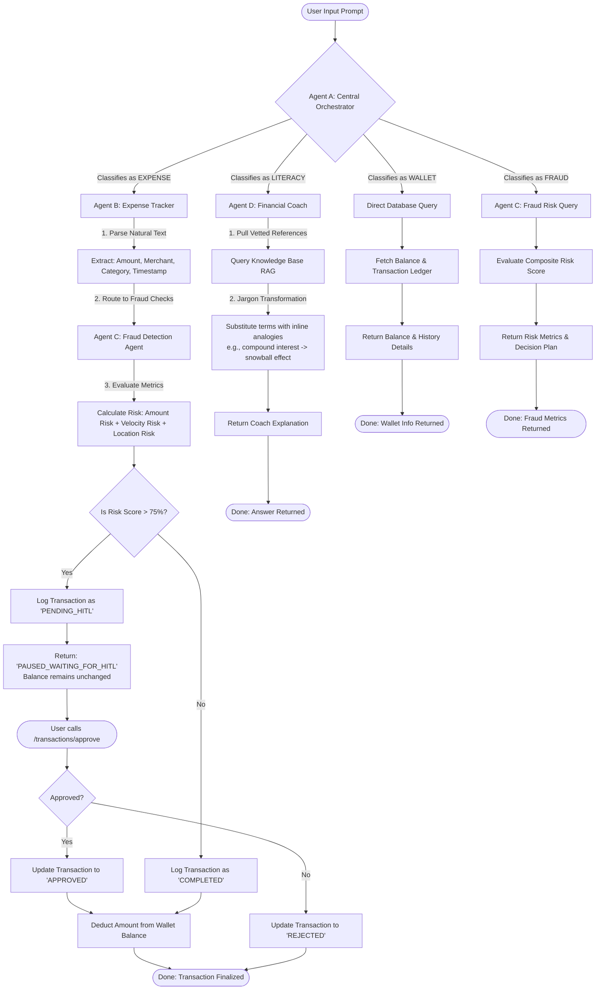

# OmniFinance Sandbox: Engineering Architecture & Build Plan

OmniFinance is an autonomous digital banking sandbox built with **FastAPI**, **Google ADK** (Agent Development Kit) routing principles, and **SQLite** (or Firestore). It simulates digital wallet operations, parses unstructured expenses, detects fraud anomalies using behavioral metrics, and coaches users on financial literacy using inline explanations.

---

## 📁 Project Structure & File Map

* **FastAPI Entrypoint:** [main.py](file:///F:/bank-ai/main.py) — Configures FastAPI endpoints, maps tool schemas, and exposes the Model Context Protocol (MCP) bridge.
* **Environment Configurations:** [config.py](file:///F:/bank-ai/config.py) — Handles global settings.
* **Project Dependencies:** [requirements.txt](file:///F:/bank-ai/requirements.txt) — Declares external requirements.
* **Local SQLite Interface:** [db.py](file:///F:/bank-ai/database/db.py) — Handles atomic balance deductions, transaction logging, and state storage.
* **Agent A (Central Orchestrator):** [orchestrator.py](file:///F:/bank-ai/agents/orchestrator.py) — Directs input prompts to specialized sub-agents and processes tool routing.
* **Agent B (Autonomous Expense Tracker):** [expense_tracker.py](file:///F:/bank-ai/agents/expense_tracker.py) — Extracts transaction schemas from natural text.
* **Agent C (AI Fraud Detection Agent):** [fraud_detector.py](file:///F:/bank-ai/agents/fraud_detector.py) — Computes fraud scores and manages HITL pauses.
* **Agent D (Financial Literacy Coach):** [literacy_coach.py](file:///F:/bank-ai/agents/literacy_coach.py) — Grounded knowledge matching and inline jargon expansion.
* **Test Simulation Harness:** [test_sandbox.py](file:///F:/bank-ai/test_sandbox.py) — Validation test running the complete multi-agent sandbox sequence.

---

## 🖼️ Visualized System Architecture


---

## 📊 System Execution Flowchart



---

## 🗄️ SQLite Database Schema

The local SQLite sandbox has the following relational schema:

```sql
-- Wallet accounts table
CREATE TABLE IF NOT EXISTS accounts (
    id TEXT PRIMARY KEY,
    currency TEXT NOT NULL DEFAULT 'USD',
    balance REAL NOT NULL DEFAULT 0.0,
    created_at TIMESTAMP DEFAULT CURRENT_TIMESTAMP
);

-- Transaction ledger (live ledger)
CREATE TABLE IF NOT EXISTS transactions (
    id TEXT PRIMARY KEY,
    account_id TEXT NOT NULL,
    amount REAL NOT NULL,
    merchant TEXT NOT NULL,
    category TEXT NOT NULL,
    location TEXT NOT NULL,
    velocity_mins INTEGER NOT NULL,
    risk_score REAL NOT NULL,
    status TEXT NOT NULL CHECK(status IN ('PENDING_HITL', 'APPROVED', 'REJECTED', 'COMPLETED')),
    timestamp TIMESTAMP DEFAULT CURRENT_TIMESTAMP,
    FOREIGN KEY(account_id) REFERENCES accounts(id)
);

-- Agent memory persistence
CREATE TABLE IF NOT EXISTS agent_memory (
    session_id TEXT NOT NULL,
    agent_id TEXT NOT NULL,
    memory_key TEXT NOT NULL,
    memory_value TEXT NOT NULL,
    updated_at TIMESTAMP DEFAULT CURRENT_TIMESTAMP,
    PRIMARY KEY (session_id, agent_id, memory_key)
);
```

---

## 🧠 ChromaDB Vector Store & RAG Pipeline

### Vector Database Schema

The literacy coach uses a **ChromaDB persistent vector store** (local `.chroma/` directory) with a single collection `financial_knowledge`:

| Field        | Type     | Description                              |
|-------------|----------|------------------------------------------|
| `id`        | `str`    | Unique term key (e.g. `"compound_interest"`) |
| `document`  | `str`    | Concatenated `definition + explanation` text |
| `embedding` | `float[]`| ONNX-generated vector (384-d, cosine space) |
| `metadata`  | `dict`   | `{term, definition, analogy, explanation}`   |

### RAG Data Flow

```
Knowledge Base (Dict) ──► seed_knowledge_base()
                               │
                    ChromaDB DefaultEmbeddingFunction
                        (ONNX all-MiniLM-L6-v2)
                               │
                    ┌──────────▼──────────┐
                    │  PersistentClient   │
                    │  → .chroma/         │
                    └──────────┬──────────┘
                               │
            Agent D ──► search_knowledge(query, n=5)
                               │
                    query → _embed_fn → ChromaDB query
                               │
                    ┌──────────▼──────────┐
                    │  Cosine similarity  │
                    │  distance → score   │
                    │  top-5 results      │
                    └──────────┬──────────┘
                               │
                Return [{term, definition, analogy, explanation, score}]
```

### Key Files

- **`database/vector_store.py`** — Implements `seed_knowledge_base()` (idempotent seeding) and `search_knowledge()` (vector search with similarity scoring). Uses ChromaDB's built-in `DefaultEmbeddingFunction` (ONNX-based, no external model download needed).
- **`database/knowledge_base.py`** — Defines the `FINANCIAL_KB` dictionary mapping financial terms to `{definition, analogy, explanation}` objects.

### Literacy Pipeline Integration (Agent D)

1. User asks a financial question (e.g. *"What is compound interest?"*)
2. Central Orchestrator routes to `FinancialLiteracyCoach`
3. Coach calls `search_knowledge(query, n_results=5)`
4. ChromaDB returns top-5 semantically similar terms with scores
5. Coach injects inline analogies into the response (e.g. *"compound interest grows like a snowball effect"*)
6. Final response returned to user

---

## ⚡ Multi-Agent Execution Path Detailed

### 1. The Expense & Fraud Pipeline (Agent B ➔ Agent C)
* When logging an expense (e.g. *"Spent $5200 on an expensive diamond ring in a Suspicious Location"*), it triggers Agent B.
* Agent B extracts structured details and passes them back to the Orchestrator, which forwards them to Agent C.
* Agent C flags the high amount (+$5000) and suspicious location, yielding an **81% risk score**. Since this exceeds **75%**, it immediately triggers the `PENDING_HITL` state.
* Only after calling the `/transactions/approve` API is the wallet balance updated.

### 2. The Literacy Pipeline (Agent D)
* When asking *"Explain compound interest and liquidity"*, Agent D retrieves definitions from the database knowledge base and processes the text to inject analogies inline, returning the coach response.
